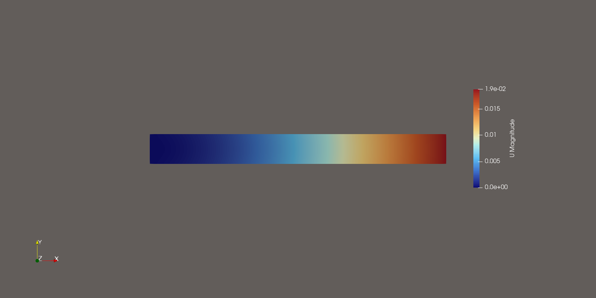
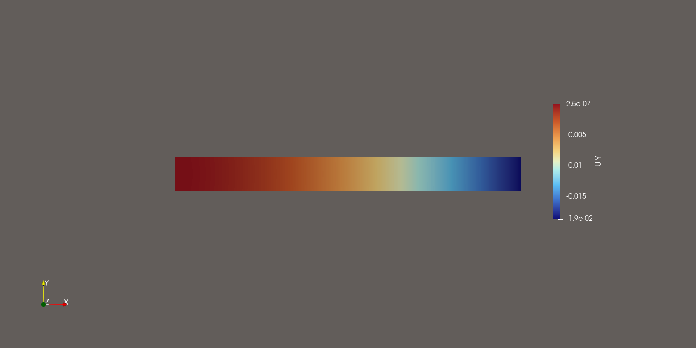
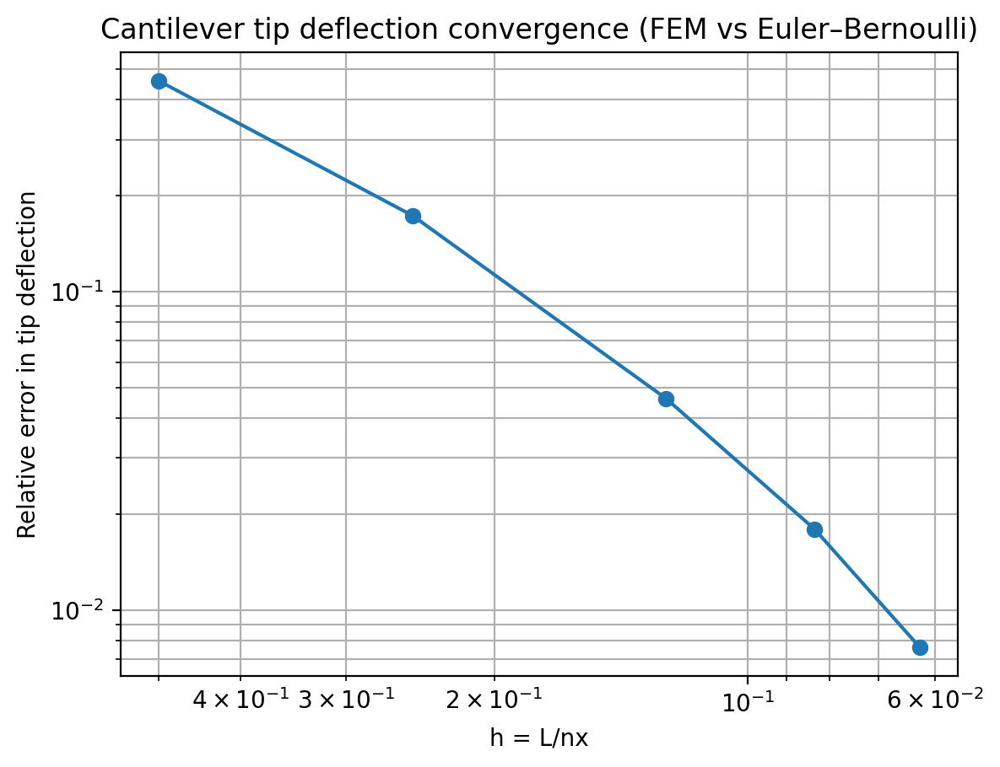

# pyfemlite

Open-source, minimal finite element solver in pure Python (NumPy/SciPy).

## Features
- 2D Poisson equation on T3 (linear) triangular elements
- 2D linear elasticity (plane stress/plane strain) on T3 triangular elements
- Named boundary groups via `Boundary` object (`left/right/top/bottom` for structured meshes)
- Dirichlet BCs by boundary group
- Neumann/traction BCs by boundary group (edge integration, 2-point Gauss)
- Legacy VTK output (view in ParaView)

## Install
```bash
pip install -e .
```

## Run examples
```bash
pyfemlite run examples/poisson_mms.py
pyfemlite run examples/cantilever_elasticity.py
```

## Boundary conditions API
Boundary groups are represented by a `Boundary` object with `nodes` and `edges` maps.
Use:
- Poisson Dirichlet: `dirichlet={"left": uD_fn, "top": uD_fn, ...}`
- Poisson Neumann: `neumann={"right": g_fn, ...}` where `g = kappa*grad(u)·n`
- Elasticity Dirichlet: `dirichlet={"left": disp_fn}`
- Elasticity traction: `traction={"right": tr_fn}` where `tr=(tx,ty)`

`Boundary.validate()` and `Boundary.summary()` support robust debugging and reproducible logs.


## Example results (screenshots)

After generating images in ParaView, save them under `docs/img/` and the README will render them automatically.

### Displacement magnitude |u|


### Vertical displacement uy


### Von Mises stress


### Tip deflection convergence



## Verification: Cantilever Tip Deflection vs Euler–Bernoulli Beam Theory

The cantilever example applies a uniform downward traction `T0` on the free end (`right` boundary group),
with the left end clamped (`left` boundary group). Under Euler–Bernoulli beam theory, the resultant end
force is:

\[
P = T_0 H \quad (\text{unit thickness})
\]

with second moment of area:

\[
I = \frac{H^3}{12}
\]

The analytical tip deflection magnitude is:

\[
\delta_{EB} = \frac{P L^3}{3 E I} = \frac{4 T_0 L^3}{E H^2}
\]

The script `examples/cantilever_elasticity.py` automatically extracts the FEM tip deflection magnitude
from nodes on the `right` boundary group and prints the FEM vs. analytical comparison.

### Mesh convergence (relative error vs mesh size)

Run:
```bash
pyfemlite run examples/cantilever_convergence.py
```

This generates:
- `cantilever_convergence.csv`
- `docs/img/cantilever_tip_deflection_convergence.png`

Embed the convergence plot:

```markdown

```

## How to visualize results (ParaView)

`pyfemlite` exports results in **VTK format**, which can be viewed using **ParaView** (free, open-source).

### 1) Install ParaView
Download from: https://www.paraview.org/download/  
Install the latest stable version for your operating system.

### 2) Generate a VTK result file
From the project root, run:

```bash
pyfemlite run examples/cantilever_elasticity.py
```

This generates:
```text
cantilever_named_bc.vtk
```

The file contains:
- Mesh (triangular elements)
- Displacement vector field `U = (ux, uy)`

### 3) Open the VTK file in ParaView
1. Launch **ParaView**
2. **File → Open** → select `cantilever_named_bc.vtk`
3. Click **Apply**

### 4) Displacement magnitude |u|
**Filters → Calculator**
```text
Result Array Name: U_mag
Expression: mag(U)
```

### 5) Vertical displacement uy
**Filters → Calculator**
```text
Result Array Name: uy
Expression: U_Y
```

### 6) Von Mises stress (derived)
1. **Filters → Gradient Of Unstructured DataSet**
   - Scalar Array: `U`
   - Result Array Name: `GradU`
2. **Filters → Calculator**
```text
Result Array Name: von_mises
Expression:
sqrt(((GradU_X - GradU_Y)^2 + GradU_X^2 + GradU_Y^2
      + 6*(0.5*(GradU_YX + GradU_XY))^2) / 2)
```

### 7) Save screenshots
**File → Save Screenshot**  
Recommended filenames:
- `cantilever_displacement_magnitude.png`
- `cantilever_uy_contour.png`
- `cantilever_von_mises.png`

Save under:
```text
docs/img/
```
